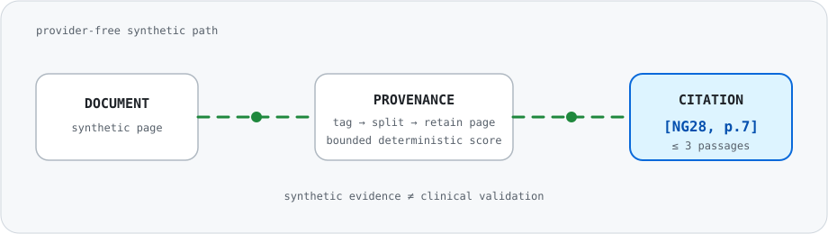
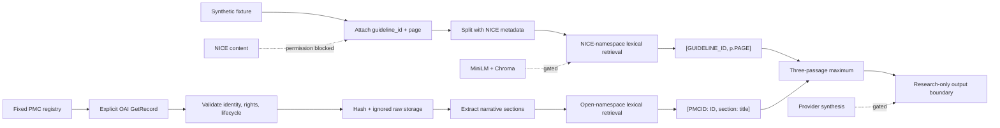

<div align="center">

# NICE-RAG

Citation-first, CPU-friendly retrieval research with explicit provenance and source gates.

<code>Python 3.11</code> <code>Local synthetic verified</code> <code>Open evidence partial</code> <code>3-passage cap</code> <code>Research use</code>



</div>

> [!CAUTION]
> NICE-RAG provides research information only. It is not clinical decision support, a medical device, or a substitute for qualified professional advice.

> [!IMPORTANT]
> This repository contains no NICE source content. Its PMC benchmark uses separately identified open-access research articles that are not NICE guidance. NICE's open-content licence does not cover AI use; NICE permission/licensing is still required before NICE content acquisition or RAG processing.

## Research problem

Retrieval demonstrations can look convincing while losing source identity, provenance, execution bounds, or the distinction between fixture output and live evidence. NICE-RAG makes those boundaries explicit. It preserves source metadata before splitting, limits retrieval to three passages, formats citations deterministically, and refuses to present synthetic fixtures or research articles as medical recommendations or provider evidence.

The current synthetic scope is `NG28`, `NG133`, `CG173`, `NG253`, and `NG189`, covering type 2 diabetes, hypertension in pregnancy, neuropathic pain, suspected sepsis in adults, and safeguarding adults in care homes.

An isolated open-evidence path targets one fixed PubMed Central article for each topic. It validates PMCID, DOI, title, licence, lifecycle metadata, full-text structure, and SHA-256 before storage. This path cannot satisfy or be labelled as NICE validation.

## Verification status

| Layer | Status | Evidence boundary |
| --- | --- | --- |
| Implementation | `IMPLEMENTED-UNVERIFIED` for a complete five-record run | Import-safe synthetic and isolated PMC paths, CLI, privacy helpers, and lazy external contracts |
| Local suite | `LOCAL-SYNTHETIC-VERIFIED` | 139 tests passed after open-evidence hardening and documentation checks on 2026-09-09 |
| PMC open evidence | `OPEN-EVIDENCE-PARTIAL` | Three of five records validated and were stored only in ignored local evidence; the bounded retry stopped at record four, record five was not attempted, and no five-query report exists |
| Kaggle synthetic gate | Historical | Private CPU kernel version 1 completed on 2026-09-08 against old-scope commit `a3ea0ef`; it does not verify the corrected tuple |
| NICE source scope/rights | `NICE-CONTENT-BLOCKED` | Topic/ID scope corrected locally; NICE AI permission/licensing not obtained |
| Embeddings, Chroma, Groq | Externally gated | Not run and not implied by synthetic validation |
| Gradio / Hugging Face | Not implemented | Separate design, privacy, and deployment approval required |

Latest bounded acquisition (`2026-09-09T16:25:37Z`) stopped safely at the first record. The newly validated PMC response differed from the existing ignored raw-file hash, so immutable storage refused to overwrite prior evidence. No later record was requested and no five-query validation ran. Readiness remains 85%; transactional staging is the next approval-gated design decision.

“Verified” in this repository means a recorded command and exit code. It does not mean clinical accuracy, medical safety, regulatory readiness, or provider quality.

## Architecture



Solid arrows are implemented and covered by offline tests. The PMC branch has only partial live acquisition evidence, so its complete five-record flow is not verified. Dashed arrows remain blocked or gated.

## How retrieval becomes a citation

1. A document receives one approved `guideline_id` before any split occurs.
2. Every chunk copies source metadata, including `page`.
3. Query and passage tokens are scored deterministically.
4. Results are ordered by score and stable input position.
5. At most three passages are returned as `[GUIDELINE_ID, p.PAGE] passage`.
6. Empty, unsupported, or missing-provenance inputs fail clearly.

The synthetic interaction lookup is also deterministic. It is a fixture boundary, not a medicines reference.

The open-evidence retriever uses a separate `pmc_open_evidence` corpus label and `[PMCID: PMC1234567, section: Section title]` citations. It rejects NICE metadata and cannot be passed into the NICE tool accidentally.

## Open-evidence acquisition

The fixed registry contains open-access research articles, not NICE guidance. Acquisition uses only the official PMC OAI-PMH `GetRecord` endpoint; it does not scrape article pages or download PDFs, figures, tables, media, or supplements.

| Topic | Fixed source | DOI | Expected rights | 2026-09-09 execution |
| --- | --- | --- | --- | --- |
| Type 2 diabetes | [PMC5256065](https://pmc.ncbi.nlm.nih.gov/articles/PMC5256065/) | [10.3389/fendo.2017.00006](https://doi.org/10.3389/fendo.2017.00006) | CC BY 4.0 | Locally validated; raw XML remains ignored |
| Hypertension in pregnancy | [PMC7886065](https://pmc.ncbi.nlm.nih.gov/articles/PMC7886065/) | [10.12703/b/9-10](https://doi.org/10.12703/b/9-10) | CC BY 4.0 | Locally validated; raw XML remains ignored |
| Neuropathic pain | [PMC10741625](https://pmc.ncbi.nlm.nih.gov/articles/PMC10741625/) | [10.3390/biom13121802](https://doi.org/10.3390/biom13121802) | CC BY 4.0 | Locally validated; raw XML remains ignored |
| Adult sepsis | [PMC4410741](https://pmc.ncbi.nlm.nih.gov/articles/PMC4410741/) | [10.1186/s12916-015-0335-2](https://doi.org/10.1186/s12916-015-0335-2) | CC BY 4.0 | Validation stopped on a URI-shape mismatch; parser fixed offline, not reacquired |
| Adult safeguarding | [PMC9261065](https://pmc.ncbi.nlm.nih.gov/articles/PMC9261065/) | [10.1186/s12877-022-03243-9](https://doi.org/10.1186/s12877-022-03243-9) | CC BY 4.0 | Not attempted after the fail-closed stop |

The retry allowance was exhausted. No complete manifest or five-query validation report was created. The sanitized attempt record is [evidence/open_evidence_acquisition_attempts.json](evidence/open_evidence_acquisition_attempts.json).

```bash
# Offline: inspect the immutable registry
python run.py --list-open-sources

# Networked and opt-in: fetch only the five fixed records
python run.py --fetch-open-evidence

# Offline: validate only a complete previously acquired local corpus
python run.py --validate-open-evidence
```

The fetch command requires a new explicit authorization because the bounded attempt and its single retry have already been used. Validation remains local and fails nonzero while the corpus or manifest is incomplete.

## Repository structure

```text
src/
  ingest.py          synthetic tagging/splitting + lazy PDF/Chroma contracts
  tools.py           bounded cited retrieval + deterministic interaction fixture
  prompts.py         exact four-variable local ReAct prompt
  agent.py           missing-key gate + lazy bounded AgentExecutor factory
  scenarios.py       five fixture-only research scenarios
  evaluation.py      offline scenario manifest and retrieval smoke
  offline_cpu.py     bounded in-memory CPU exercise
  open_registry.py   immutable five-article PMC identity/rights contract
  pmc_client.py      allowlisted, bounded standard-library OAI client
  open_ingest.py     JATS validation, exclusion, hashing, and local storage
  open_retrieval.py  isolated deterministic PMCID/section citations
  privacy.py         restricted-path classification
  protocol.py        identifiers, paths, pins, citation and safety contracts
  storage.py         declarative persistent-store configuration
tests/               dependency-free contract and release tests
evidence/            sanitized execution metadata; never article text
notebooks/           private Kaggle synthetic-validation notebook and runbook
assets/              repository-hosted README visual
run.py               offline CLI
requirements.txt     declared remote integration environment
```

## Install

Python 3.11 is the local target. The complete pinned integration environment is intended for the private Kaggle validation path:

```bash
python -m venv .venv
# Windows PowerShell
.\\.venv\\Scripts\\Activate.ps1
python -m pip install -r requirements.txt
```

The source modules used by the offline path require only the Python standard library. Running the tests additionally requires pytest. Do not silently install packages when reproducing an existing environment; report missing dependencies.

## Offline verification

From the repository root:

```bash
python -m compileall src tests
python -m pytest -q
python run.py --list-scenarios
python run.py --list-open-sources
python run.py --cpu-smoke --documents 1000 --repeats 1
```

Example CLI shape:

```text
$ python run.py --cpu-smoke --documents 1000 --repeats 1
CPU-only synthetic stress check
documents=1000
...
max_passages=3
all_citations_valid=True
```

The ellipsis is illustrative formatting, not stored run evidence. See [STATUS.md](STATUS.md) for exact dated results.

Fresh local evidence from `2026-09-09T16:01:42Z`–`16:01:48Z`: `compileall` exit 0; `pytest` exit 0 with 139 passes; five `gated_no_live_trace` synthetic scenarios; five fixed open-source registry entries; and a 1,000-document synthetic smoke with 3,200 chunks, five cited results, `max_passages=3`, and `all_citations_valid=True`. The smoke and scenario results are synthetic only. Open-evidence citation validity and five-query determinism remain unverified because the complete five-record corpus was not acquired.

## Private Kaggle validation

The checked-in [notebook](notebooks/kaggle_nice_rag.ipynb) runs in the private kernel `ajinkya1225/19-nice-rag-validation`. Version 1 completed on 2026-09-08 against old-scope commit `a3ea0ef`: Python 3.12.13 on Linux, compile exit 0, 69 tests passed, the bounded smoke retained valid citations and a three-passage maximum, five scenarios remained `gated_no_live_trace`, and the restricted-artifact result was empty. The downloaded evidence JSON has SHA-256 `3f4d21f1f141f02ab76f206a38582f2323c8421fad6946c22c37310898ba6b47`. This is historical execution evidence and does not verify the corrected five-scope tuple.

Follow [the Kaggle runbook](notebooks/KAGGLE_RUNBOOK_nice_rag.md). The kernel must remain private, CPU-only, use no attached datasets or models, and stop after the restricted-artifact scan. A `COMPLETE` kernel status is insufficient without inspecting the downloaded evidence file.

## Provenance and citation contracts

- The approved synthetic tuple is `NG28`, `NG133`, `CG173`, `NG253`, and `NG189`.
- The tuple is locally synthetic-verified only; it is not an acquired or remotely validated live corpus.
- The PMC registry is an independent five-article corpus and may never be labelled as NICE evidence.
- PMC acquisition validates PMCID, DOI, normalized front-matter title, allowlisted Creative Commons URI, lifecycle state, MIME type, size, and official host before storage.
- Raw responses are SHA-256 hashed and stored only under ignored `data/open_evidence/raw/`; a different hash cannot silently overwrite an existing record.
- Figures, captions, tables, formulas, media, acknowledgements, references, author notes, email, and supplements are excluded from narrative extraction.
- Open-evidence chunks receive corpus, topic, article, section, rights, retrieval-time, and source-hash metadata before splitting.
- Open citations use `[PMCID: PMC1234567, section: Section title]` and remain separate from NICE page citations.
- `guideline_id` is attached before splitting.
- Page metadata remains attached to every chunk.
- Retrieval emits strings in `[GUIDELINE_ID, p.PAGE]` format.
- Retrieval returns no more than three passages.
- The ReAct template is local and has exactly `{tools}`, `{tool_names}`, `{agent_scratchpad}`, and `{input}`.
- Missing provider credentials return a safe unavailable state; they do not masquerade as execution.
- Five scenario records are fixture inputs with `gated_no_live_trace` output status.

## Privacy and security

- Retrieved text is untrusted evidence and cannot override agent constraints.
- Raw NICE PDFs, PMC XML, credentials, environment files, model caches, Chroma stores, patient data, and unreviewed traces are excluded from Git and public export.
- Optional runtime imports are lazy, keeping offline import and test paths provider-free.
- Network access is confined to one standard-library client with an exact HTTPS host, redirect checks, finite timeout, response-size cap, accepted XML media types, and no automatic retry or fallback.
- CPU smoke inputs are synthetic, in-memory, and bounded to 50,000 documents and 100 query repeats by source-level guards.
- The public export is scanned for secrets, private paths, restricted suffixes, and internal workflow files.

## Limitations

- Synthetic lexical retrieval does not establish performance on NICE documents.
- Three PMC records were locally validated, but a complete five-record manifest and open-evidence citation report do not exist; `OPEN-EVIDENCE-VERIFIED` is not claimed.
- The PMC sources are research articles, not guidance, and their retrieval does not establish clinical correctness or suitability for a care decision.
- The corrected five-scope tuple has not been rerun in Kaggle or against NICE content.
- NICE AI permission/licensing has not been obtained; source acquisition and processing are prohibited.
- Package installation does not verify PDF extraction, embedding quality, Chroma persistence, or Groq behavior.
- The five scenarios contain no live answers or qualitative provider traces.
- No Gradio application or Hugging Face deployment is included.
- No clinical accuracy, safety, efficacy, or regulatory claim is made.
- No software `LICENSE` file has been approved; absent an explicit license, reuse rights are not granted by this repository.

## Reproducibility

Use a clean Python 3.11 environment, retain the repository commit hash, and run the offline commands above without attached data or credentials. The open registry and all parser/client/retrieval tests use invented fixtures. Do not run the fetch command without current authorization. A permitted acquisition must retain source revision, UTC time, official method, HTTP/MIME metadata, byte count, SHA-256, section/chunk counts, and skipped gates without publishing article text.

For Kaggle, use the checked-in notebook and metadata, then retain the downloaded evidence JSON with its kernel version, timestamp, dependency versions, source revision, exit codes, test count, CPU-smoke fields, scenario count, and restricted-artifact result. The historical kernel does not verify the new PMC path.

The dependency set is intentionally historical and pinned around LangChain 0.2. It resolved in the 2026-09-08 Kaggle image; that installation evidence does not prove the gated PDF, model, vector-store, provider, or interface integrations and does not authorize migration to newer APIs.

## Attribution

This repository contains no NICE PDFs or downloaded guideline text. NICE's UK open content licence explicitly excludes AI use, so attribution or OGL language alone does not authorize NICE-RAG acquisition, indexing, retrieval, or generation. Any future use requires NICE approval/licensing for the exact AI purpose and territory, third-party-rights review, and the attribution required by that licence. “NICE” identifies the intended source and does not imply endorsement.

The open-evidence registry links each article and DOI and records its expected CC BY 4.0 rights. Runtime checks must confirm article-level rights before use. Article XML and extracted prose are not distributed by this repository; users should follow each linked source's current licence and attribution requirements.

## Roadmap

- [x] Synthetic provenance, retrieval, citation, privacy, CLI, and CPU contracts
- [x] Fail-closed private Kaggle synthetic-validation workflow
- [x] User-approved correction of the five guideline/topic scopes
- [x] Isolated PMC registry, OAI client, JATS validation, provenance, and deterministic citation implementation
- [x] Three-record partial acquisition with a sanitized failed-attempt record
- [ ] Newly authorized complete five-record PMC acquisition and five-query validation
- [ ] NICE AI permission/licence and approved source-provenance record
- [ ] Approved embedding download and persistent Chroma build/read-back
- [ ] Approved Groq execution and five qualitative traces
- [ ] Gradio implementation, release review, and separately approved deployment

See [REMOTE_EXECUTION.md](REMOTE_EXECUTION.md) for the gated sequence and [CONTRIBUTING.md](CONTRIBUTING.md) for safe contribution rules.
