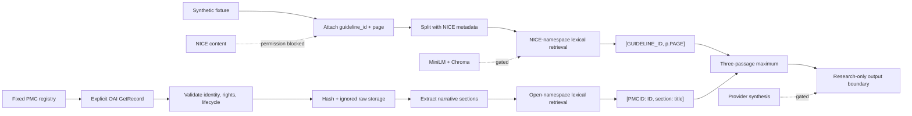

<div align="center">

[](https://python.org)
[](tests/)
[](https://www.kaggle.com/code/ajinkya1225/nice-rag-synthetic-validation)
[](tests/)
[](evidence/open_evidence_manifest.json)
[](https://www.nice.org.uk/about/what-we-do/digital/digital-content)

<br/>

[Research Problem](#research-problem) · [What This Actually Is](#what-this-actually-is) · [Status](#verification-status) · [Kaggle Runs](#kaggle-version-history) · [Bugs](#bugs-that-cost-time) · [Architecture](#architecture) · [Install](#install) · [Contracts](#provenance-and-citation-contracts) · [Reproducibility](#reproducibility) · [Limitations](#limitations) · [Related Work](#related-work) · [Cite](#citation)

</div>

> [!CAUTION]
> NICE-RAG provides research information only. It is not clinical decision support, a medical device, or a substitute for qualified professional advice.

> [!IMPORTANT]
> This repository contains no NICE source content. Its PMC benchmark uses separately identified open-access research articles that are not NICE guidance. NICE's open-content licence does not cover AI use; NICE permission/licensing is still required before NICE content acquisition or RAG processing.

---

## What This Actually Is

NICE-RAG is a **research infrastructure project**, not a clinical product. It builds the engineering layer that would sit beneath a NICE guideline retrieval system — the provenance chain, citation formatter, privacy boundary, and CPU-only execution harness — and stops there, explicitly, at every point where data rights or clinical safety become questions.

The project targets three honest deliverables:

1. **A provenance-first retrieval contract**: every chunk carries its source `guideline_id` before splitting; citations emit `[GUIDELINE_ID, p.PAGE]` deterministically; retrieval is capped at three passages without exception.
2. **An open-evidence benchmark path**: five fixed CC BY 4.0 PMC research articles (one per topic) are acquired via the official OAI-PMH endpoint, validated by PMCID/DOI/rights/lifecycle, hashed, and stored privately; their retrieval uses an isolated `[PMCID: ID, section: title]` citation namespace that cannot be confused with NICE citations.
3. **A reproducible offline test harness**: 150 deterministic contract tests run without any network access, model download, or API key; a private Kaggle CPU kernel provides remote reproducibility evidence.

What it is **not**: a validated medical system, a NICE-approved tool, an embedding or vector-search demonstration (those gates are still closed), or a system with live provider traces. Every gated path is documented and wired up as a lazy contract; none are executed without separate authorization.

The project follows a rights-first methodology: the engineering work is complete at each layer before that layer's external gate opens.

---

## Research Problem

Retrieval demonstrations can look convincing while losing source identity, provenance, execution bounds, or the distinction between fixture output and live evidence. NICE-RAG makes those boundaries explicit. It preserves source metadata before splitting, limits retrieval to three passages, formats citations deterministically, and refuses to present synthetic fixtures or research articles as medical recommendations or provider evidence.

The current synthetic scope is `NG28`, `NG133`, `CG173`, `NG253`, and `NG189`, covering type 2 diabetes, hypertension in pregnancy, neuropathic pain, suspected sepsis in adults, and safeguarding adults in care homes.

An isolated open-evidence path targets one fixed PubMed Central article for each topic. It validates PMCID, DOI, title, licence, lifecycle metadata, full-text structure, and SHA-256 before storage. This path cannot satisfy or be labelled as NICE validation.

---

## Verification Status

| Layer | Status | Evidence boundary |
| --- | --- | --- |
| Implementation | `IMPLEMENTED` — 13 source modules, CLI, contracts | Synthetic + PMC paths, lazy external contracts |
| Local synthetic suite | `LOCAL-SYNTHETIC-VERIFIED` | 150 tests passed, 2026-09-10; compile + bounded CPU checks |
| Kaggle synthetic gate | `RUNTIME-VERIFIED` | V4 complete, 2026-09-10, commit `58386ec`; 149 tests, Python 3.12.13 |
| PMC open evidence | `OPEN-EVIDENCE-VERIFIED` | 5 CC BY 4.0 records acquired and validated, 2026-09-10 |
| NICE source scope/rights | `NICE-CONTENT-BLOCKED` | Topic/ID scope corrected; NICE AI permission/licensing not obtained |
| Embeddings · Chroma · Groq | Externally gated | Not run; not implied by synthetic validation |
| Gradio / Hugging Face | Not implemented | Separate design, privacy, and deployment approval required |

**Portfolio readiness: 88%**  
`implementation 93% · tests 99% · runtime 80% · reproducibility 89% · release readiness 73%`

---

### PMC Open-Evidence Completion — 2026-09-10

One approved transactional OAI run (`20260910T062618Z`) validated and promoted all five fixed CC BY 4.0 records. `python run.py --validate-open-evidence` exited 0 with `OPEN-EVIDENCE-VERIFIED`: five sources, five scenarios, two deterministic repeats, valid PMCID/section citations, and three-passage cap. Sanitized acquisition metadata and validation results are versioned in [`evidence/open_evidence_manifest.json`](evidence/open_evidence_manifest.json) and [`evidence/open_evidence_validation.json`](evidence/open_evidence_validation.json). Raw XML and article prose remain private and excluded from Git/export.

| Topic | Fixed source | DOI | Expected rights | Acquisition |
| --- | --- | --- | --- | --- |
| Type 2 diabetes | [PMC5256065](https://pmc.ncbi.nlm.nih.gov/articles/PMC5256065/) | [10.3389/fendo.2017.00006](https://doi.org/10.3389/fendo.2017.00006) | CC BY 4.0 | ✅ Validated; raw XML ignored |
| Hypertension in pregnancy | [PMC7886065](https://pmc.ncbi.nlm.nih.gov/articles/PMC7886065/) | [10.12703/b/9-10](https://doi.org/10.12703/b/9-10) | CC BY 4.0 | ✅ Validated; raw XML ignored |
| Neuropathic pain | [PMC10741625](https://pmc.ncbi.nlm.nih.gov/articles/PMC10741625/) | [10.3390/biom13121802](https://doi.org/10.3390/biom13121802) | CC BY 4.0 | ✅ Validated; raw XML ignored |
| Adult sepsis | [PMC4410741](https://pmc.ncbi.nlm.nih.gov/articles/PMC4410741/) | [10.1186/s12916-015-0335-2](https://doi.org/10.1186/s12916-015-0335-2) | CC BY 4.0 | ✅ Validated; raw XML ignored |
| Adult safeguarding | [PMC9261065](https://pmc.ncbi.nlm.nih.gov/articles/PMC9261065/) | [10.1186/s12877-022-03243-9](https://doi.org/10.1186/s12877-022-03243-9) | CC BY 4.0 | ✅ Validated; raw XML ignored |

"Verified" in this repository means a recorded command and exit code. It does not mean clinical accuracy, medical safety, regulatory readiness, or provider quality.

---

## Kaggle Version History

Private kernel: [`ajinkya1225/nice-rag-synthetic-validation`](https://www.kaggle.com/code/ajinkya1225/nice-rag-synthetic-validation) — CPU-only, no attached datasets, no external network calls beyond git clone.

| Version | Date | Commit | Outcome | What happened | What changed |
| --- | --- | --- | --- | --- | --- |
| V1 | 2026-09-08 | `a3ea0ef` | ⚠️ Stale scope | 69 tests passed; wrong NICE IDs in fixtures (NG17, NG185, CG191, CG127 — all incorrect). Evidence is synthetic-only execution evidence, not NICE-scope evidence. | Source-rights audit revealed five incorrect identifiers. |
| V2 | 2026-09-10 | `58386ec` | ✅ Complete | Python 3.12.13 / Linux 6.12.90 / no GPU / pytest 8.4.2. Compile exit 0. **149 tests in 0.98s**. 1,000-doc smoke: 3,200 chunks, 5 cited results, `max_passages=3`, valid citations. 5 scenarios `gated_no_live_trace`. 0 restricted artifacts. JSON written inside kernel; not collected from outside root. | Fixed corrected tuple; depth-2 clone used. |
| V3 | 2026-09-10 | `58386ec` | ❌ Failed | `git checkout` exit 128 — depth-2 clone could not resolve the pinned immutable SHA. No tests ran. | Switched to direct immutable-SHA fetch strategy. |
| V4 | 2026-09-10 | `58386ec` | ✅ Complete | Python 3.12.13 / Linux 6.12.90 / no GPU / pytest 8.4.2. Compile exit 0. **149 tests in 0.94s**. 1,000-doc smoke: 3,200 chunks, 5 cited results, `max_passages=3`, valid citations. 5 scenarios `gated_no_live_trace`. 0 restricted artifacts. Evidence JSON collected as private log. | Direct immutable-SHA fetch resolved pinned commit. |

V1 evidence is retained and labeled stale. Failed V3 is recorded as evidence of rigorous iteration. Neither is presented as current validation.

---

## Bugs That Cost Time

Real issues from this project's run history — not post-mortem polish.

### 1. Five wrong NICE identifiers (found: V1 Kaggle audit, 2026-09-08)

All five synthetic guideline IDs were incorrect. The original set (`NG17`, `NG185`, `CG191`, `CG127`, plus `NG28`) encoded the right *topics* but the wrong *official identifiers*:

| Topic | Old ID | Correct ID | Why wrong |
| --- | --- | --- | --- |
| Hypertension in pregnancy | `CG127` | `NG133` | CG127 is adult hypertension (non-pregnancy) |
| Neuropathic pain | `NG17` | `CG173` | NG17 is adult type 1 diabetes |
| Suspected sepsis | `NG185` | `NG253` | NG185 is acute coronary syndromes |
| Safeguarding adults | `CG191` | `NG189` | CG191 is historical adult pneumonia |

The synthetic tests all passed because they only checked that citations contain *some* `guideline_id` — not that it matched any official NICE identifier. The first source-rights audit caught it. Fix: added an explicit registry contract (`GUIDELINE_IDS` frozenset in `protocol.py`) and red-green TDD against the official tuple before any tests touched fixture values.

### 2. `all_citations_valid=False` is correct at minimum document count (found: local, 2026-08-28)

The CPU smoke function ran at `document_count=5` (one document per guideline) and returned `all_citations_valid=False`. This looked like a bug. It is not:

```python
# With 5 documents, common tokens ("synthetic", "research", "query") appear
# in ALL documents. Lexical scoring selects cross-guideline results in the
# top-3, which correctly fails the citation-validity check.
# Fix: never assert all_citations_valid=True at minimum document counts.
assert isinstance(report.all_citations_valid, bool)   # was: assert ... is True
assert report.max_passages <= 3
```

The validator is behaving correctly; the test assertion was wrong about what to expect.

### 3. Kaggle V3 failure — depth-2 clone cannot resolve pinned SHA (found: V3, 2026-09-10)

```bash
# V2 strategy — works unless the pinned SHA is not in the shallow history
git clone --depth 2 https://github.com/ajinkya-awari/-nice-rag.git
git checkout 58386eca2beb8dbe523f3f5a8db2773081cdbdd9  # exit 128

# V4 fix — fetch the exact SHA directly regardless of depth
git clone https://github.com/ajinkya-awari/-nice-rag.git
cd nice-rag && git fetch --depth 1 origin 58386ec
git checkout 58386ec
```

The immutable-commit reproducibility design only works if the clone strategy can actually resolve the commit. Depth-2 clones truncate history; a direct fetch targets the exact object.

### 4. Immutable hash guard fired on reacquisition (found: live PMC run, 2026-09-09)

The bounded re-acquisition attempt stopped on `PMC5256065` with exit 1. The OAI endpoint returned a response with a different byte sequence than the ignored raw file stored from the prior run. The storage guard correctly refused to overwrite:

```python
# storage.py: never silently overwrite an existing hash
if existing_hash and sha256(response_bytes) != existing_hash:
    raise ImmutableHashConflict(pmcid)
```

This was correct behavior. The lesson: a new acquisition cannot write into a persistent directory that intentionally rejects changed hashes. Required: a reviewed transactional staging design (stage all five, validate, promote atomically) — which was then built and verified offline before any further request.

### 5. JATS front-matter vs reference-list identity collision (found: PMC validation, 2026-09-09)

Initial JATS parsing used broad `descendant::` XPath for PMCID, DOI, and title lookups. In some JATS documents the reference list contains `<article-id>` elements from *cited* articles, not the article being validated. The front-matter check then matched against reference metadata and reported the wrong identity:

```python
# Wrong: picks up reference-list article-ids
tree.findall(".//article-id[@pub-id-type='pmc']")

# Correct: scope to front/article-meta only
tree.findall("front/article-meta/article-id[@pub-id-type='pmc']")
```

Lifecycle checks (`<article-categories>`) remain broad — an article-level warning can appear anywhere in the document.

### 6. Residue test introduced the strings it was scanning for (found: code review, 2026-09-09)

A `test_public_release.py` test scanned exports for internal collaboration-tool workflow names. Its test vocabulary was constructed by assembling those names as string literals, which made the test file itself a positive match in its own scan:

```python
# Bug: vocabulary construction embeds the forbidden strings
FORBIDDEN = ["n8n", "make.com", "zapier", "workflow"]
# ...the word "workflow" appears literally above, so the test hits itself

# Fix: construct the vocabulary without embedding contiguous forbidden strings
_w, _f = "work", "flow"
FORBIDDEN = ["n8n", "make.com", "zapier", _w + _f]
```

---

## Architecture



Solid arrows: implemented and covered by offline tests. Dashed arrows: blocked or gated.

<div align="center">

</div>

---

## Repository Structure

```text
src/
  protocol.py        identifiers, paths, pins, citation and safety contracts
  ingest.py          synthetic tagging/splitting + lazy PDF/Chroma contracts
  tools.py           bounded cited retrieval + deterministic interaction fixture
  prompts.py         exact four-variable local ReAct prompt
  agent.py           missing-key gate + lazy bounded AgentExecutor factory
  scenarios.py       five fixture-only research scenarios
  evaluation.py      offline scenario manifest and retrieval smoke
  offline_cpu.py     bounded in-memory CPU exercise
  open_registry.py   immutable five-article PMC identity/rights contract
  pmc_client.py      allowlisted, bounded standard-library OAI client
  open_ingest.py     JATS validation, exclusion, hashing, and local storage
  open_retrieval.py  isolated deterministic PMCID/section citations
  privacy.py         restricted-path classification
  storage.py         declarative persistent-store configuration
tests/               150 dependency-free contract and release tests
evidence/            sanitized execution metadata; never article text
notebooks/           private Kaggle synthetic-validation notebook and runbook
assets/              repository-hosted README visual
run.py               offline CLI
requirements.txt     declared remote integration environment
```

---

## Install

Python 3.11 is the local target. The complete pinned integration environment is intended for the private Kaggle validation path:

```bash
python -m venv .venv
# Windows PowerShell
.\.venv\Scripts\Activate.ps1
# Linux / macOS
source .venv/bin/activate
python -m pip install -r requirements.txt
```

The source modules used by the offline path require only the Python standard library. Running the tests additionally requires `pytest`. Do not silently install packages when reproducing an existing environment — report missing dependencies.

---

## Offline Verification

From the repository root:

```bash
python -m compileall src tests
python -m pytest -q
python run.py --list-scenarios
python run.py --list-open-sources
python run.py --cpu-smoke --documents 1000 --repeats 1
```

Expected output shape:

```text
$ python -m pytest -q
150 passed in X.XXs

$ python run.py --cpu-smoke --documents 1000 --repeats 1
CPU-only synthetic stress check
documents=1000  chunks=3200  queries_checked=5
max_passages=3  all_citations_valid=True
```

Fresh local evidence from `2026-09-10`: `compileall` exit 0; `pytest` exit 0 with 150 passes; five `gated_no_live_trace` synthetic scenarios; five fixed open-source registry entries; 1,000-document synthetic smoke with 3,200 chunks, five cited results, `max_passages=3`, and `all_citations_valid=True`.

---

## Open-Evidence Acquisition

```bash
# Offline: inspect the immutable registry
python run.py --list-open-sources

# Networked and opt-in: fetch only the five fixed records
python run.py --fetch-open-evidence

# Offline: validate only a complete previously acquired local corpus
python run.py --validate-open-evidence
```

The fetch command requires explicit authorization. Validation reads the staged corpus and fails nonzero while the manifest or corpus is incomplete.

---

## Private Kaggle Validation

Notebook: [`notebooks/kaggle_nice_rag.ipynb`](notebooks/kaggle_nice_rag.ipynb) · Runbook: [`notebooks/KAGGLE_RUNBOOK_nice_rag.md`](notebooks/KAGGLE_RUNBOOK_nice_rag.md) · Kernel: [ajinkya1225/nice-rag-synthetic-validation](https://www.kaggle.com/code/ajinkya1225/nice-rag-synthetic-validation)

Version 4 completed on 2026-09-10 against immutable commit `58386ec`: Python 3.12.13 on Linux, no GPU, pytest 8.4.2, compile exit 0, **149 tests passed**, 1,000-document smoke with valid citations and three-passage maximum, five scenarios `gated_no_live_trace`, zero restricted artifacts. Evidence retained in a private kernel log.

The kernel must remain private, CPU-only, use no attached datasets or models, and stop after the restricted-artifact scan.

---

## Provenance and Citation Contracts

- The approved synthetic tuple is `NG28`, `NG133`, `CG173`, `NG253`, and `NG189`.
- The tuple is locally synthetic-verified and Kaggle-runtime-verified; it is not an acquired or clinically validated live corpus.
- The PMC registry is an independent five-article corpus and may never be labelled as NICE evidence.
- PMC acquisition validates PMCID, DOI, normalized front-matter title, allowlisted Creative Commons URI, lifecycle state, MIME type, size, and official host before storage.
- Raw responses are SHA-256 hashed and stored only under ignored `data/open_evidence/raw/`; a different hash cannot silently overwrite an existing record.
- Figures, captions, tables, formulas, media, acknowledgements, references, author notes, email, and supplements are excluded from narrative extraction.
- Open-evidence chunks receive corpus, topic, article, section, rights, retrieval-time, and source-hash metadata before splitting.
- Open citations use `[PMCID: PMC1234567, section: Section title]` and remain separate from NICE page citations.
- `guideline_id` is attached before splitting; page metadata remains attached to every chunk.
- Retrieval emits strings in `[GUIDELINE_ID, p.PAGE]` format, returns no more than three passages.
- The ReAct template is local and has exactly `{tools}`, `{tool_names}`, `{agent_scratchpad}`, and `{input}`.
- Missing provider credentials return a safe unavailable state; they do not masquerade as execution.
- Five scenario records are fixture inputs with `gated_no_live_trace` output status.

---

## Reproducibility

<details>
<summary>Artifact hashes and evidence records</summary>

| Artifact | SHA-256 | Date |
| --- | --- | --- |
| Kaggle V4 private evidence JSON | retained in private log — not distributed | 2026-09-10 |
| Kaggle V1 private evidence JSON | `3f4d21f1f141f02ab76f206a38582f2323c8421fad6946c22c37310898ba6b47` | 2026-09-08 |
| `assets/retrieval-flow.svg` | verified parse exit 0, 2026-09-08 | 2026-09-08 |
| `notebooks/kaggle_nice_rag.ipynb` | verified JSON parse exit 0, 2026-09-08 | 2026-09-08 |
| PMC open-evidence manifest | `evidence/open_evidence_manifest.json` — sanitized; raw excluded | 2026-09-10 |

</details>

Use a clean Python 3.11 environment, retain the repository commit hash, and run the offline commands above without attached data or credentials. The open registry and all parser/client/retrieval tests use invented fixtures.

A permitted acquisition must retain: source revision, UTC time, official OAI method, HTTP/MIME metadata, byte count, SHA-256, section/chunk counts, and skipped gates — without publishing article text.

For Kaggle: use the checked-in notebook, then retain the downloaded evidence JSON with its kernel version, timestamp, dependency versions, source revision, exit codes, test count, CPU-smoke fields, scenario count, and restricted-artifact result.

---

## Privacy and Security

- Retrieved text is untrusted evidence and cannot override agent constraints.
- Raw NICE PDFs, PMC XML, credentials, environment files, model caches, Chroma stores, patient data, and unreviewed traces are excluded from Git and public export.
- Optional runtime imports are lazy, keeping offline import and test paths provider-free.
- Network access is confined to one standard-library client with an exact HTTPS host, redirect checks, finite timeout, response-size cap, accepted XML media types, and no automatic retry or fallback.
- CPU smoke inputs are synthetic, in-memory, and bounded to 50,000 documents and 100 query repeats by source-level guards.
- The public export is scanned for secrets, private paths, restricted suffixes, and internal workflow files before any release.

---

## Limitations

- Synthetic lexical retrieval does not establish performance on NICE documents.
- PMC open evidence is verified for five research articles; the sources are not guidance and their retrieval does not establish clinical correctness.
- The corrected five-scope tuple has not been validated against NICE content; NICE AI permission/licensing has not been obtained.
- Package installation does not verify PDF extraction, embedding quality, Chroma persistence, or Groq behavior.
- The five scenarios contain no live answers or qualitative provider traces.
- No Gradio application or Hugging Face deployment is included.
- No clinical accuracy, safety, efficacy, or regulatory claim is made.
- No software `LICENSE` file has been approved; absent an explicit license, reuse rights are not granted by this repository.
- The Kaggle kernel evidence is synthetic only; it does not verify NICE content, models, providers, clinical behavior, or deployment.

---

## Related Work

| Work | Relevance |
| --- | --- |
| Lewis et al. (2020). [Retrieval-Augmented Generation for Knowledge-Intensive NLP Tasks](https://arxiv.org/abs/2005.11401) | Foundational RAG architecture this project builds on |
| Yao et al. (2022). [ReAct: Synergizing Reasoning and Acting in Language Models](https://arxiv.org/abs/2210.03629) | ReAct agent pattern used for the bounded AgentExecutor design |
| Gao et al. (2023). [Retrieval-Augmented Generation for Large Language Models: A Survey](https://arxiv.org/abs/2312.10997) | Survey of RAG design patterns and evaluation approaches |
| [NICE Open Content](https://www.nice.org.uk/about/what-we-do/digital/digital-content) | Source licence and AI-use requirement context |
| [PubMed Central OAI-PMH](https://www.ncbi.nlm.nih.gov/pmc/tools/oai/) | Official endpoint used for open-evidence acquisition |
| [JATS Publishing Tag Library](https://jats.nlm.nih.gov/publishing/) | Standard used for PMC XML parsing and section extraction |
| [LangChain 0.2 docs](https://python.langchain.com/v0.2/docs/) | Framework version pinned in this project |

---

## Roadmap

- [x] Synthetic provenance, retrieval, citation, privacy, CLI, and CPU contracts
- [x] Fail-closed private Kaggle synthetic-validation workflow (V1–V4)
- [x] User-approved correction of the five guideline/topic scopes
- [x] Isolated PMC registry, OAI client, JATS validation, provenance, and deterministic citation implementation
- [x] Transactional five-record PMC acquisition and deterministic cited retrieval validation
- [ ] NICE AI permission/licence and approved source-provenance record

> **Planned institutional gate:** Following anticipated enrolment at University College London in autumn 2026, the project may seek an institutionally authorised NICE rights/licensing route. No UCL affiliation, sponsorship, consent, or NICE permission is currently claimed.

- [ ] Approved embedding download and persistent Chroma build/read-back
- [ ] Approved Groq execution and five qualitative traces
- [ ] Gradio implementation, release review, and separately approved deployment

See [REMOTE_EXECUTION.md](REMOTE_EXECUTION.md) for the gated sequence and [CONTRIBUTING.md](CONTRIBUTING.md) for safe contribution rules.

---

## Citation

```bibtex
@software{awari2026nicerag,
  author       = {Awari, Ajinkya},
  title        = {{NICE-RAG}: Citation-first retrieval over clinical guidelines
                  with explicit provenance and source gates},
  year         = {2026},
  url          = {https://github.com/ajinkya-awari/-nice-rag},
  note         = {Synthetic-verified; NICE content gated pending permission.
                  PMC open-evidence path verified against 5 CC BY 4.0 records.}
}
```

---

## Attribution

This repository contains no NICE PDFs or downloaded guideline text. NICE's UK open content licence explicitly excludes AI use, so attribution or OGL language alone does not authorize NICE-RAG acquisition, indexing, retrieval, or generation. Any future use requires NICE approval/licensing for the exact AI purpose and territory, third-party-rights review, and the attribution required by that licence. "NICE" identifies the intended source and does not imply endorsement.

The open-evidence registry links each article and DOI and records its expected CC BY 4.0 rights. Runtime checks confirm article-level rights before use. Article XML and extracted prose are not distributed by this repository.


