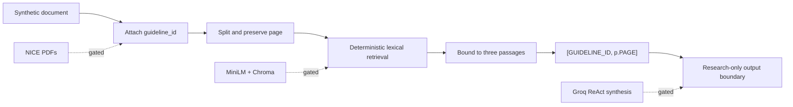

<div align="center">

# NICE-RAG

Citation-first retrieval contracts for a bounded, CPU-friendly NICE guideline research scaffold.

<code>Python 3.11</code> <code>Synthetic-only</code> <code>3-passage cap</code> <code>Research use</code>


</div>

> [!CAUTION]
> NICE-RAG provides research information only. It is not clinical decision support, a medical device, or a substitute for qualified professional advice.

> [!IMPORTANT]
> This repository contains no NICE source content. The synthetic scope was corrected on 2026-09-09 to the user-approved, topic-aligned identifiers. NICE's open-content licence does not cover AI use; NICE permission/licensing is still required before content acquisition or RAG processing.

## Research problem

Retrieval demonstrations can look convincing while losing source identity, page provenance, execution bounds, or the distinction between fixture output and live evidence. NICE-RAG makes those boundaries explicit. It preserves guideline and page metadata before splitting, limits retrieval to three passages, formats citations deterministically, and refuses to present synthetic fixtures as medical recommendations or provider evidence.

The current synthetic scope is `NG28`, `NG133`, `CG173`, `NG253`, and `NG189`, covering type 2 diabetes, hypertension in pregnancy, neuropathic pain, suspected sepsis in adults, and safeguarding adults in care homes.

## Verification status

| Layer | Status | Evidence boundary |
| --- | --- | --- |
| Implementation | Implemented | Import-safe source, synthetic fixtures, CLI, privacy helpers, and lazy external contracts |
| Local suite | `LOCAL-SYNTHETIC-VERIFIED` | 70 tests passed after the approved scope correction on 2026-09-09 |
| Kaggle synthetic gate | Historical | Private CPU kernel version 1 completed on 2026-09-08 against old-scope commit `a3ea0ef`; it does not verify the corrected tuple |
| NICE source scope/rights | `BLOCKED` | Topic/ID scope corrected locally; NICE AI permission/licensing not obtained |
| Embeddings, Chroma, Groq | Externally gated | Not run and not implied by synthetic validation |
| Gradio / Hugging Face | Not implemented | Separate design, privacy, and deployment approval required |

“Verified” in this repository means a recorded command and exit code. It does not mean clinical accuracy, medical safety, regulatory readiness, or provider quality.

## Architecture



Solid arrows are exercised by the synthetic path. Dashed arrows are declared integration boundaries and remain unverified until their individual gates are approved.

## How retrieval becomes a citation

1. A document receives one approved `guideline_id` before any split occurs.
2. Every chunk copies source metadata, including `page`.
3. Query and passage tokens are scored deterministically.
4. Results are ordered by score and stable input position.
5. At most three passages are returned as `[GUIDELINE_ID, p.PAGE] passage`.
6. Empty, unsupported, or missing-provenance inputs fail clearly.

The synthetic interaction lookup is also deterministic. It is a fixture boundary, not a medicines reference.

## Repository structure

```text
src/
  ingest.py          synthetic tagging/splitting + lazy PDF/Chroma contracts
  tools.py           bounded cited retrieval + deterministic interaction fixture
  prompts.py         exact four-variable local ReAct prompt
  agent.py           missing-key gate + lazy bounded AgentExecutor factory
  scenarios.py       five fixture-only research scenarios
  evaluation.py      offline scenario manifest and retrieval smoke
  offline_cpu.py     bounded in-memory CPU exercise
  privacy.py         restricted-path classification
  protocol.py        identifiers, paths, pins, citation and safety contracts
  storage.py         declarative persistent-store configuration
tests/               dependency-free contract and release tests
notebooks/           private Kaggle synthetic-validation notebook and runbook
assets/              repository-hosted README visual
run.py               offline CLI
requirements.txt     declared remote integration environment
```

## Install

Python 3.11 is the local target. The complete pinned integration environment is intended for the private Kaggle validation path:

```bash
python -m venv .venv
# Windows PowerShell
.\\.venv\\Scripts\\Activate.ps1
python -m pip install -r requirements.txt
```

The source modules used by the offline path require only the Python standard library. Running the tests additionally requires pytest. Do not silently install packages when reproducing an existing environment; report missing dependencies.

## Offline verification

From the repository root:

```bash
python -m compileall src tests
python -m pytest -q
python run.py --list-scenarios
python run.py --cpu-smoke --documents 1000 --repeats 1
```

Example CLI shape:

```text
$ python run.py --cpu-smoke --documents 1000 --repeats 1
CPU-only synthetic stress check
documents=1000
...
max_passages=3
all_citations_valid=True
```

The ellipsis is illustrative formatting, not stored run evidence. See [STATUS.md](STATUS.md) for exact dated results.

Fresh local evidence from 2026-09-09: `compileall` exit 0; `pytest` exit 0 with 70 passes; five corrected `gated_no_live_trace` scenarios; and a 1,000-document smoke with 3,200 chunks, five cited results, `max_passages=3`, and `all_citations_valid=True`. These are synthetic results only.

## Private Kaggle validation

The checked-in [notebook](notebooks/kaggle_nice_rag.ipynb) runs in the private kernel `ajinkya1225/19-nice-rag-validation`. Version 1 completed on 2026-09-08 against old-scope commit `a3ea0ef`: Python 3.12.13 on Linux, compile exit 0, 69 tests passed, the bounded smoke retained valid citations and a three-passage maximum, five scenarios remained `gated_no_live_trace`, and the restricted-artifact result was empty. The downloaded evidence JSON has SHA-256 `3f4d21f1f141f02ab76f206a38582f2323c8421fad6946c22c37310898ba6b47`. This is historical execution evidence and does not verify the corrected five-scope tuple.

Follow [the Kaggle runbook](notebooks/KAGGLE_RUNBOOK_nice_rag.md). The kernel must remain private, CPU-only, use no attached datasets or models, and stop after the restricted-artifact scan. A `COMPLETE` kernel status is insufficient without inspecting the downloaded evidence file.

## Provenance and citation contracts

- The approved synthetic tuple is `NG28`, `NG133`, `CG173`, `NG253`, and `NG189`.
- The tuple is locally synthetic-verified only; it is not an acquired or remotely validated live corpus.
- `guideline_id` is attached before splitting.
- Page metadata remains attached to every chunk.
- Retrieval emits strings in `[GUIDELINE_ID, p.PAGE]` format.
- Retrieval returns no more than three passages.
- The ReAct template is local and has exactly `{tools}`, `{tool_names}`, `{agent_scratchpad}`, and `{input}`.
- Missing provider credentials return a safe unavailable state; they do not masquerade as execution.
- Five scenario records are fixture inputs with `gated_no_live_trace` output status.

## Privacy and security

- Retrieved text is untrusted evidence and cannot override agent constraints.
- Raw NICE PDFs, credentials, environment files, model caches, Chroma stores, patient data, and unreviewed traces are excluded.
- Optional runtime imports are lazy, keeping offline import and test paths provider-free.
- CPU smoke inputs are synthetic, in-memory, and bounded to 50,000 documents and 100 query repeats by source-level guards.
- The public export is scanned for secrets, private paths, restricted suffixes, and internal workflow files.

## Limitations

- Synthetic lexical retrieval does not establish performance on NICE documents.
- The corrected five-scope tuple has not been rerun in Kaggle or against NICE content.
- NICE AI permission/licensing has not been obtained; source acquisition and processing are prohibited.
- Package installation does not verify PDF extraction, embedding quality, Chroma persistence, or Groq behavior.
- The five scenarios contain no live answers or qualitative provider traces.
- No Gradio application or Hugging Face deployment is included.
- No clinical accuracy, safety, efficacy, or regulatory claim is made.
- No software `LICENSE` file has been approved; absent an explicit license, reuse rights are not granted by this repository.

## Reproducibility

Use a clean Python 3.11 environment, retain the repository commit hash, and run the four offline commands above without attached data or credentials. For Kaggle, use the checked-in notebook and metadata, then retain the downloaded evidence JSON with its kernel version, timestamp, dependency versions, source revision, exit codes, test count, CPU-smoke fields, scenario count, and restricted-artifact result.

The dependency set is intentionally historical and pinned around LangChain 0.2. It resolved in the 2026-09-08 Kaggle image; that installation evidence does not prove the gated PDF, model, vector-store, provider, or interface integrations and does not authorize migration to newer APIs.

## Attribution

This repository contains no NICE PDFs or downloaded guideline text. NICE's UK open content licence explicitly excludes AI use, so attribution or OGL language alone does not authorize NICE-RAG acquisition, indexing, retrieval, or generation. Any future use requires NICE approval/licensing for the exact AI purpose and territory, third-party-rights review, and the attribution required by that licence. “NICE” identifies the intended source and does not imply endorsement.

## Roadmap

- [x] Synthetic provenance, retrieval, citation, privacy, CLI, and CPU contracts
- [x] Fail-closed private Kaggle synthetic-validation workflow
- [x] User-approved correction of the five guideline/topic scopes
- [ ] NICE AI permission/licence and approved source-provenance record
- [ ] Approved embedding download and persistent Chroma build/read-back
- [ ] Approved Groq execution and five qualitative traces
- [ ] Gradio implementation, release review, and separately approved deployment

See [REMOTE_EXECUTION.md](REMOTE_EXECUTION.md) for the gated sequence and [CONTRIBUTING.md](CONTRIBUTING.md) for safe contribution rules.
